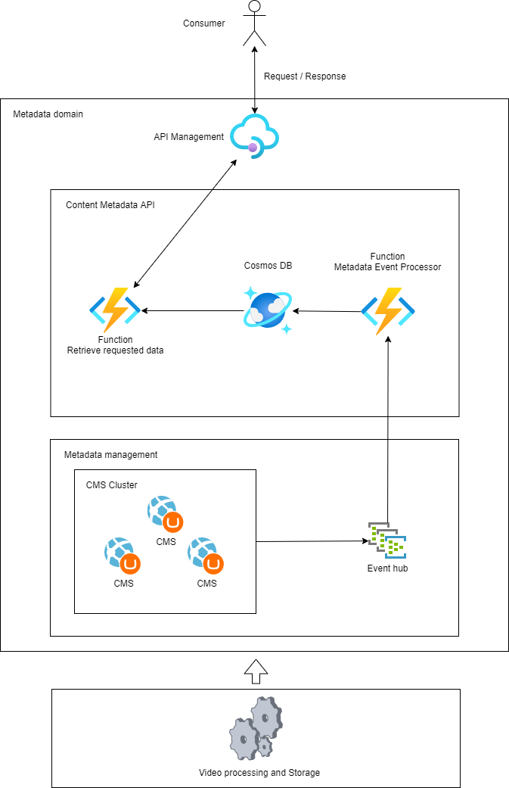

# Content Metadata API
The following solution provides an API for retrieving Content Metadata for use in external systems. 

# Architecture
The architecture is designed as follows:

## Consumer
The consumer can be any web request capable client, be it another service, SPA web app or mobile app. 

## Metadata domain
The metadata domain includes the resources directly related to any manipulation of the content metadata.

## Content Metadata API
The content Metadata API is the core of the infrastructure responsible for delivering the required metadata for the current case - it contains the central scalable services.

### Function - retrieve requested metadata
The Azure Function in this layer is reponsible for delivering a scalable solution for retrieving the metadata for the requested video, based on the ID passed in the request.

### Cosmos DB
The Cosmos DB service takes care of persisting the metadata records associated with specific videos. It provides a scalable, geo-redundant, high-performance NOSQL storage solution, which scale on demand based on the load that is being applied to it. 

## Metadata management
The metadata management layer houses the services responsible for keeping the metadata fetched within the "Content Metadata API" layer up to date.

### CRUD Function/s - Metadata Event Processor
Responsible for processing events from the event hub and executing the appropriate action for updating/deleting.

### CMS Cluster
A cluster of WebApps running dedicated CMSs for managing the content data that is then emitted and stored in the CosmosDB.

### Event Hub
Takes care of storing the emitted events from the CMS and relaying them to the Function/s resposible for updating the CosmosDB with the emitted data.
